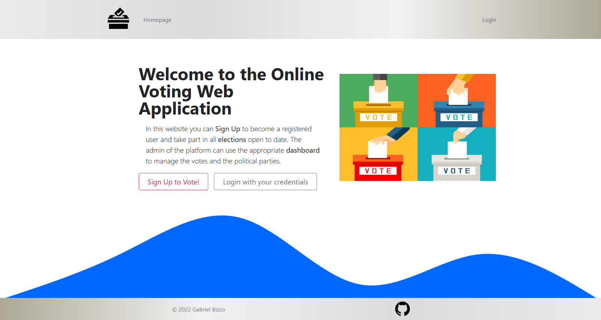

# Online Voting React FE
[](http://hits.dwyl.com/killbizz/Online-Voting-React-FE)
[](https://shields.io/)

Frontend module repository of the student internship project made up for Sync Lab company using Nextjs framework.

This software consists of a web application that implements an *electronic voting system*.
Electronic voting, also known as e-Voting, consists of a set of methodologies that allow citizens to express their vote and view their voting history through information technologies.

This web application allows the user to create their own personal account. Following an authentication procedure, the voter can access a page to cast a vote.
The system, in addition to acquiring voter preferences, offers to a set of platform administrators tools to create, configure and monitor different types of elections, as well as to manage the insertion and removal of participating political parties.



## Website Usage

You can test the website by doing one of the following:

- Create a new personal **user account** through the registration page and use it to authenticate. Then go to your personal dashboard to view all available elections
- Use the **administrator credentials** ( `admin@admin.com`, `Password123$` ) in the login page and go to the admin dashboard to access all the admin tools

## Installation

### Clone Repository

```
git clone https://github.com/killbizz/Online-Voting-React-FE.git
```

### Install Dependencies
```
npm install
```

### Run Local Application
```
npm run dev
```

### Main Dependencies

- [Node.js](https://nodejs.org/)
- [TypeScript](https://www.typescriptlang.org/)
- [Next.js](https://nextjs.org/)
- [React.js](https://it.reactjs.org/)
- [Bootstrap](https://getbootstrap.com/) : website styling
- [Vercel](https://vercel.com/) : website deployment
- [NProgress](https://www.npmjs.com/package/nprogress) : loading bar component
- [js-cookie](https://www.npmjs.com/package/js-cookie) : cookie handling
- [Paper.js](http://paperjs.org/) : vector graphics scripting
- [Moment.js](https://www.npmjs.com/package/moment) : date manipulation
- [Recharts](https://recharts.org/en-US/) : election chart component
- [jsonwebtoken](https://www.npmjs.com/package/jsonwebtoken) : json web token utilities
- [NextAuth.js](https://next-auth.js.org/) : Authentication and session handling
